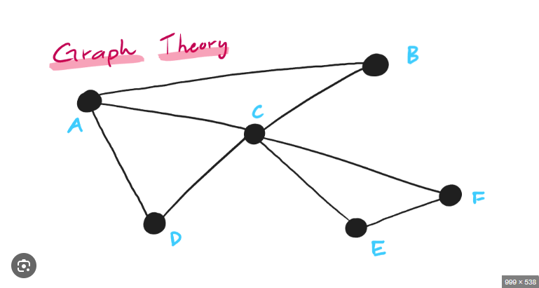

# Day 1: Graph Representation using Adjacency List

## Problem Statement

Given an undirected graph, represent it using an **adjacency list** and print the adjacency list for all vertices.
## Input

No user input. The graph is hardcoded based on this structure

Output:
[[B,C,D], 
  [A,C], 
  [A,B,D,E,F], 
  [A,C], 
  [C,F], 
  [C,E]]

🧠 Intuition Behind the Code

Adjacency List Initialization
The graph contains 6 nodes (A to F). Each node requires its own list of adjacent vertices, so we initialize an ArrayList of 6 empty ArrayList<Character> elements — one for each node.

Edge Insertion Logic
We define a utility method add(source, destination, adjList) to insert undirected edges. For each edge:

Convert the node (e.g., 'A') to an integer index using:
index = node - 'A'

Add the destination node to the source node’s adjacency list.

Add the source node to the destination node’s adjacency list — since the graph is undirected.

Why ASCII Offset Works
Java stores characters as ASCII values. 'A' has ASCII 65. So:

'A' - 'A' = 0 → index 0

'B' - 'A' = 1 → index 1
and so on. This allows constant-time access to the correct list for each node.