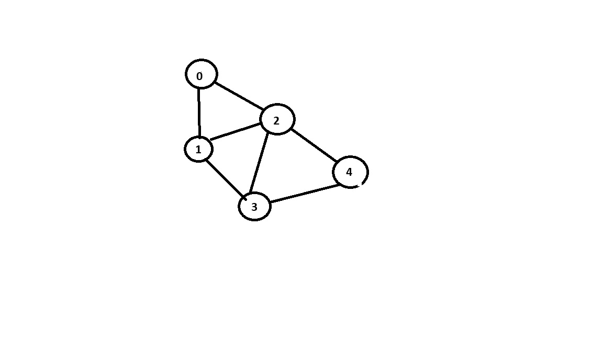

This project contains an implementation of Depth-First Search (DFS) on a graph using an adjacency list. DFS is a fundamental graph traversal algorithm used in:

🧠 Intuition

Each node is visited exactly once.

DFS explores as far as possible along a branch before backtracking.

Requires a visited[] array to track visited nodes and avoid cycles.

🛠️ How It Works

Build the adjacency list from the given edges.

Initialize a visited array of size V (number of vertices).

Call DFS on every unvisited node.

Mark a node as visited and recursively call DFS on its neighbors.